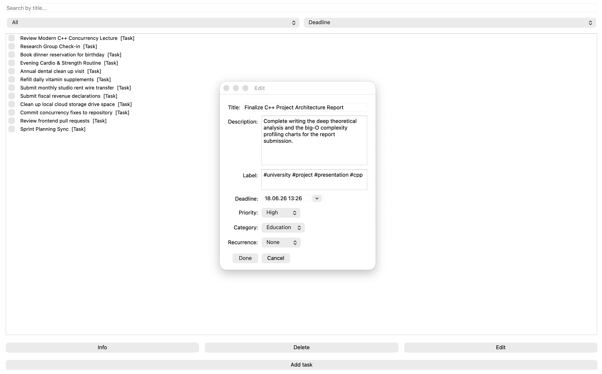

# **todo** — Smart Task Manager

A modern C++ task management application featuring a multithreaded backend server, Qt6 GUI, and intelligent reminder system.



## Table of Contents

- [Overview](#overview)
- [Prerequisites](#prerequisites)
- [Installation](#installation)
- [Quick Start](#quick-start)
- [Features](#features)
- [Usage Guide](#usage-guide)
- [Project Structure](#project-structure)
- [Architecture](#architecture)
- [Proposed Extensions](#proposed-extensions)
- [Development Team](#development-team)

---

## Overview

**todo** is a networked to-do application demonstrating enterprise C++ patterns:

- **Distributed Architecture:** TCP-based client-server communication with protocol serialization
- **Concurrent Processing:** Multi-threaded backend with mutex-protected shared state
- **Smart Features:** Background reminder scheduler using `std::chrono` and thread timers
- **Modern C++ Stack:** C++20, smart pointers, Qt6, CMake, cross-platform support

This project showcases real-world software engineering practices including multi-threading, network IPC, GUI development, and persistent storage.

---

## Prerequisites

- **macOS 10.14+** (Linux/Windows compatible with adjustments)
- **C++20 compiler** (clang, g++, or MSVC)
- **CMake 3.16** or higher
- **Qt6** (install via `brew install qt`)
- **Git** for version control

---

## Installation

### 1. Clone the Repository
```bash
git clone https://github.com/MalteLoos/todo.git
cd todo
```

### 2. Install Dependencies

**macOS:**
```bash
brew install qt cmake
```

**Linux (Ubuntu/Debian):**
```bash
sudo apt-get install qt6-base-dev cmake build-essential
```

### 3. Build the Project

```bash
cmake -B build -S .
cmake --build build
```

The build creates two executables:
- `build/backend/todo_backend` — Server process
- `build/frontend/todo_gui` — GUI client application

---

## Quick Start

### Start the Backend Server
**Terminal 1:**
```bash
./build/backend/todo_backend
```

Expected output:
```
[Server] Listening on port 5000...
[Server] Waiting for client connections...
```

### Launch the GUI Client
**Terminal 2:**
```bash
./build/frontend/todo_gui
```

The GUI window will open and connect to the backend server.

---

## Features

✅ **Multi-Client Support** — Multiple users can connect and manage independent task lists  
✅ **Task Management** — Create, edit, delete, and organize tasks with priorities  
✅ **Smart Reminders** — Background thread monitors deadlines and triggers notifications  
✅ **Persistent Storage** — Tasks automatically saved to disk and restored on startup  
✅ **Thread-Safe Operations** — Mutex-protected concurrent access to shared task data  
✅ **Network IPC** — Binary protocol-based message passing between client and server  
✅ **Modern GUI** — Qt6 widgets with responsive layout and event-driven architecture  

---

## Usage Guide

### Creating a Task
1. Launch the GUI client
2. Enter task name in the input field
3. Set priority level (High/Medium/Low)
4. Enter due date and time
5. Click "Add Task"

### Managing Tasks
- **View All Tasks** — Default list displays all tasks sorted by due date
- **Set Reminder** — Tasks trigger notifications 15 minutes before deadline
- **Mark Complete** — Check task to mark as done
- **Delete Task** — Remove task from list

### Server Operations
- The backend automatically persists tasks to `user/data.json`
- Gracefully handles client disconnections
- Supports concurrent user sessions with isolated task lists

---

## Project Structure

```
todo/
├── .vscode/
│   └── tasks.json            # VS Code build/debug task definitions
|
├── backend/                  # Server-side logic and services
│   ├── include/
│   │   ├── backend.hpp       # Backend server interface and request handling
│   │   ├── reminder.hpp      # Background reminder scheduling service
│   │   └── taskStorage.h     # Persistence layer interface
│   │
│   ├── src/
│   │   ├── backend.cpp       # Backend implementation
│   │   ├── main.cpp          # Backend application entry point
│   │   ├── reminder.cpp      # Reminder scheduling implementation
│   │   └── taskStorage.cpp   # File storage implementation
│   │
│   └── CMakeLists.txt        # Backend build configuration
|
├── frontend/                 # Client-side application and user interaction
│   ├── include/
│   │   ├── tasks/
│   │   │   ├── recurring_task.h   # Specialized recurring task type
│   │   │   └── timed_task.h        # Task with timing functionality
│   │   │
│   │   ├── client.hpp        # Communication layer for backend interaction
│   │   └── taskManager.h     # Frontend business logic (CRUD, search, sorting)
│   │
│   ├── src/
│   │   ├── tasks/
│   │   │   ├── recurring_task.cpp
│   │   │   └── timed_task.cpp
│   │   │
│   │   ├── client.cpp        # Client networking implementation
│   │   ├── main.cpp          # Frontend application entry point
│   │   ├── mainGUI.cpp       # Qt GUI implementation
│   │   └── taskManager.cpp   # Task management implementation
│   │
│   └── CMakeLists.txt        # Frontend build configuration
|
├── shared/                   # Code shared by frontend and backend
│   ├── include/
│   │   ├── msg.hpp           # Common communication protocol/messages
│   │   └── task.h            # Core Task domain model
│   │
│   └── src/
│       └── task.cpp          # Task implementation
|
├── .gitignore                # Files/directories excluded from version control
|
├── CMakeLists.txt            # Root build configuration coordinating all modules
|
└── README.md                 # Project overview, setup instructions, and documentation
```

---

## Architecture

### Backend Server
- **Multi-threaded TCP server** accepting client connections on port 5000
- **User session management** with isolated task maps per user ID
- **ReminderScheduler** runs background thread monitoring task deadlines
- **TaskStorage** serializes/deserializes tasks to JSON

### Frontend Client
- **Qt6 GUI** with QMainWindow, QListWidget, and button actions
- **Network client** connects to backend via TCP socket
- **Signal/slot architecture** for responsive UI updates
- **Task synchronization** receives updates from server

### Communication Protocol
- Binary message format with serialized task objects
- Message types: `ADD`, `DELETE`, `UPDATE`, `LIST`, `NOTIFY`, `ERROR`
- Per-user isolation ensures data privacy

### Concurrency Model
- `std::mutex` protects shared `users` map in backend
- `std::lock_guard` ensures exception-safe locking
- `std::thread` runs reminder scheduler asynchronously
- `std::chrono` handles deadline calculations

---

## Proposed Extensions

- [ ] Dynamic Qt detection without hardcoded paths
- [ ] Graceful error handling with user-facing dialogs
- [ ] Complete remaining message type handlers
- [ ] Unit tests for Task class and storage layer
- [ ] Logging framework (spdlog) for debugging
- [ ] Configuration file support for server port, storage paths
- [ ] Data corruption recovery mechanisms
- [ ] User authentication system

## Development Team


| Contributor | GitHub Username | Role / Subsystem Focus |
| :--- | :--- | :--- |
| **Student 1** | [@Jonida-Zekaj](https://github.com/Jonida-Zekaj) | Core Architecture & Data Management (Backend) |
| **Student 2** | [@MalteLoos](https://github.com/MalteLoos) | Advanced Utilities & Concurrency (Service Layer) |
| **Student 3** | [@dannyzer575](https://github.com/dannyzer575) | GUI Developer & User Interaction (Frontend) |
